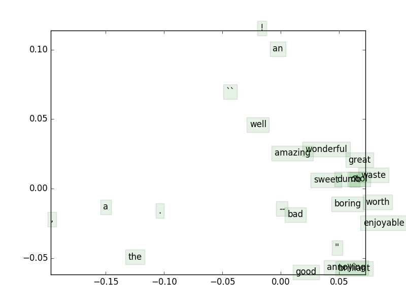
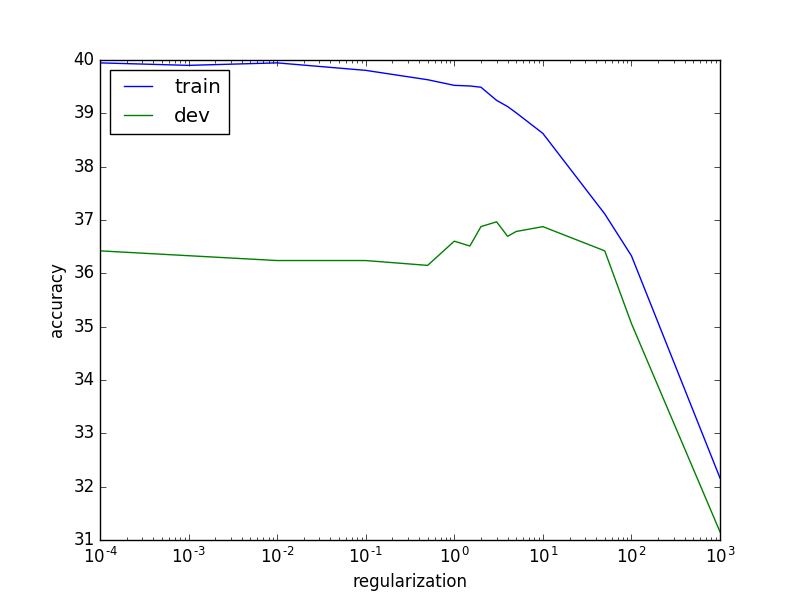
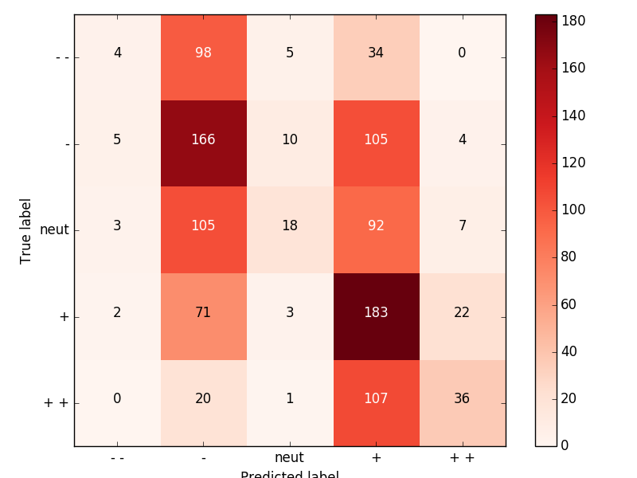

# CS 224N: Assignment #1

writer: 纪焘


## 1、Softmax

### (a)

$$
\begin{align*}
	softmax(x+c)_i 
	&= \frac{e^{x_i+c}}{\sum_j e^{x_j+c}}\\
	&=\frac{e^{x_i}e^{c}}{\sum_j e^{x_j}e^{c}}\\
	&=\frac{e^{x_i}}{\sum_j e^{x_j}}\\
	&=softmax(x)_i
\end{align*}
$$

### (b)

```python
if len(x.shape) > 1:
        # Matrix        
        c = np.max(x, axis=1).reshape(x.shape[0], 1)
        x = np.exp(x - c)
        norm = np.sum(x, axis=1).reshape(x.shape[0], 1)
        x = x / norm     
    else:
        # Vector
        c = np.max(x)
        x = np.exp(x - c)
        x = x / x.sum()
```


## 2、Neural Network Basics

### (a)

$$
\begin{align*}
	\nabla_x \sigma(x)
	&= \nabla_x \Big( \frac{1}{1+e^{-x}}\Big)\\
	&=\nabla_x  \Big[ ( {1+e^{-x}} )^{-1} \Big]\\
	&=-({1+e^{-x}})^{-2} \cdot \nabla_x ( {1+e^{-x}} )\\
	&=-({1+e^{-x}})^{-2} \cdot e^{-x} \cdot  \nabla_x {-x} \\
	&=\frac{1+e^{-x}-1}{(1+e^{-x} )^{2}}\\
	&=\frac{1}{(1+e^{-x} )} \cdot -\frac{1}{(1+e^{-x} )^{2}}\\
	&=\sigma(x) \cdot (1-\sigma(x))
\end{align*}
$$

### (b)

*Assume that only the $k$-th dimension of $y$ is one.*
$$
\begin{align*}
	\nabla_{\theta}CE(\boldsymbol  y, \hat{\boldsymbol  y}) 
	&= \nabla_{\theta} \Big[ -\sum_{i}y_i \log (\hat{y_i}) \Big]\\
	&= \nabla_{\theta} \Big[ -y_k \log (\hat{y_k}) \Big]\\
	&= \nabla_{\theta} \Big[ -\log (\frac{e^{\theta_k}}{\sum_{j}e^{\theta_j}}) \Big]\\
	&= \nabla_{\theta} \Big[ -\log (e^{\theta_k}) +\log ({\sum_{j}e^{\theta_j}}) \Big]\\
	&= \nabla_{\theta} \Big[\log ({\sum_{j}e^{\theta_j}})  -\theta_k \Big]\\
	if \quad t =k:&\\
	&=\nabla_{\theta_t} \Big[\log ({\sum_{j}e^{\theta_j}}) \Big] - \nabla_{\theta_t}  \theta_k \\
	&=\frac{\nabla_{\theta_t}  \big( \sum_{j}e^{\theta_j}\big)}{\sum_{j}e^{\theta_j}}-1\\
	&=\frac{e^{\theta_t}}{\sum_{j}e^{\theta_j}}-1\\
	&=\hat{\boldsymbol  y_t} - 1\\
	if \quad t \neq k:&\\
	&=\nabla_{\theta_t} \Big[\log ({\sum_{j}e^{\theta_j}}) \Big] - \nabla_{\theta_t}  \theta_k \\
	&=\frac{\nabla_{\theta_t}  \big( \sum_{j}e^{\theta_j}\big)}{\sum_{j}e^{\theta_j}}\\
	&=\frac{e^{\theta_t}}{\sum_{j}e^{\theta_j}}\\
	&=\hat{\boldsymbol  y_t} \\	
	\therefore \quad\nabla_{\theta}CE(\boldsymbol  y, \hat{\boldsymbol  y}) 
	&=\hat{\boldsymbol  y}-\boldsymbol  y
\end{align*}
$$

### (c)

*symbol definition:*

$\boldsymbol  a=\boldsymbol x \boldsymbol W_1+ \boldsymbol b_1​$

$\boldsymbol  h=\sigma(\boldsymbol x \boldsymbol W_1+ \boldsymbol b_1)=\sigma(\boldsymbol  a) $

$\boldsymbol  z=\boldsymbol h \boldsymbol W_2+ \boldsymbol b_2$

$\hat{\boldsymbol  y}=softmax(\boldsymbol h \boldsymbol W_2+ \boldsymbol b_2)=softmax(\boldsymbol  z) $
$$
\begin{align*}
	\nabla_{\boldsymbol x}CE(\boldsymbol  y, \hat{\boldsymbol  y}) 
	&=\frac{\partial J}{\partial \boldsymbol z}CE(\boldsymbol  y, \hat{\boldsymbol  y}) \cdot \frac{\partial \boldsymbol z}{\partial \boldsymbol h} \boldsymbol (\boldsymbol h \boldsymbol W_2+ \boldsymbol b_2) \cdot \frac{\partial \boldsymbol h}{\partial \boldsymbol a} \sigma( \boldsymbol  a) \cdot \frac{\partial \boldsymbol a}{\partial \boldsymbol x} \boldsymbol (\boldsymbol x \boldsymbol W_1+ \boldsymbol b_1) \\
	&= (\hat{\boldsymbol  y}-\boldsymbol  y) \cdot  \boldsymbol W_2^\top \cdot \sigma( \boldsymbol a) \cdot(1-\sigma( \boldsymbol a)) \cdot  \boldsymbol W_1^\top
\end{align*}
$$

### (d)

**Input** $\to$ **Hidden**:

$D_x*H+H$

**Hidden** $\to$ **Output**:

$H*D_y+D_y$

**Total**:

$(D_x+1)*H+(H+1)*D_y$


### (e)

```python
def sigmoid(x):
    s = 1. / (1. + np.exp(-x))
    return s


def sigmoid_grad(s):
    ds = s * (1. - s)
    return ds
```


### (f)

```python
def gradcheck_naive(f, x):
	### ...
    x[ix] += h
    random.setstate(rndstate)
    fx1, _ = f(x)
    x[ix] -= 2 * h
    random.setstate(rndstate)
    fx2, _ = f(x)
    numgrad = (fx1-fx2) / (2.0*h)
    x[ix] += h
    ### ...
    
```


### (g)

```python
def forward_backward_prop(data, labels, params, dimensions):
    
    ### YOUR CODE HERE: forward propagation   
    M = data.shape[0]
    # (M, H)
    a = np.dot(data, W1) + b1 
    hiddens = sigmoid(a)   
    # (M, Dy)
    z = np.dot(hiddens, W2) + b2  
    outputs = softmax(z)

    ### END YOUR CODE

    cost = -1 * labels * np.log(outputs)
    cost = cost.sum() / M

    ### YOUR CODE HERE: backward propagation

    # (M, Dy)
    gradZs = outputs - labels   
    # (M, H, Dx)
    gradW2 = np.array([np.dot(hiddens[i].reshape(1, H).T, gradZs[i].reshape(1, Dy)) for i in xrange(M)])
    # (H, Dx)
    gradW2 = gradW2.sum(axis=0) * (1.0/M)
    # (1, Dx)
    gradb2 = (gradZs.sum(axis=0) * (1.0/M)).reshape(1, Dy)
    # (M, H)
    gradAs = np.array([np.dot(gradZs[i].reshape(1, Dy), W2.T)*sigmoid_grad(hiddens[i]) for i in xrange(M)])
    # (M, Dx, H)
    gradW1 = np.array([np.dot(data[i].reshape(1, Dx).T, gradAs[i].reshape(1, H)) for i in xrange(M)])
    # (Dx, H)
    gradW1 = gradW1.sum(axis=0) * (1.0/M)
    # (1, H)
    gradb1 = gradAs.sum(axis=0) * (1.0/M)

    ### END YOUR CODE
```


## 	3、word2vec

### (a)

$$
\begin{align*}
	\nabla_{\boldsymbol v_c}CE(\boldsymbol  y, \hat{\boldsymbol  y}) 
	&= \nabla_{\boldsymbol v_c} \Big[ -\sum_i y_i \log (\hat{y}_i) \Big]\\
	&= \nabla_{\boldsymbol v_c} \Big[ - y_o \log (\hat{y}_o) \Big]\\
	&= \nabla_{\boldsymbol v_c} \Big[ -  \log (\frac{\exp(\boldsymbol u_o^\top\boldsymbol v_c )}{\sum_{w=1}^{W} \exp(\boldsymbol u_w^\top\boldsymbol v_c)}) \Big]\\	
	&= \nabla_{\boldsymbol v_c} \Big[ -  \log \big(\exp(\boldsymbol u_o^\top\boldsymbol v_c )\big)+\log\big({\sum_{w=1}^{W} \exp(\boldsymbol u_w^\top\boldsymbol v_c)}\big) \Big]\\	
	&= \nabla_{\boldsymbol v_c} \big( - \boldsymbol u_o^\top\boldsymbol v_c \big)+\nabla_{\boldsymbol v_c} \Big[\log\big({\sum_{w=1}^{W} \exp(\boldsymbol u_w^\top\boldsymbol v_c)}\big) \Big]\\	
	&=- \boldsymbol u_o + \frac{1}{{\sum_{w=1}^{W} \exp(\boldsymbol u_w^\top\boldsymbol v_c)}}\cdot\nabla_{\boldsymbol v_c} \Big[{\sum_{w=1}^{W} \exp(\boldsymbol u_w^\top\boldsymbol v_c)} \Big]\\
	&=- \boldsymbol u_o + \frac{1}{{\sum_{w=1}^{W} \exp(\boldsymbol u_w^\top\boldsymbol v_c)}}\cdot {\sum_{j=1}^{W} \exp(\boldsymbol u_j^\top\boldsymbol v_c)}  \cdot\nabla_{\boldsymbol v_c} (\boldsymbol u_j^\top\boldsymbol v_c)) \\
	&=- \boldsymbol u_o + \sum_{j=1}^{W} \frac{{ \exp(\boldsymbol u_j^\top\boldsymbol v_c)}}{{\sum_{w=1}^{W} \exp(\boldsymbol u_w^\top\boldsymbol v_c)}}\cdot   \boldsymbol u_j \\
	&=- \boldsymbol u_o + \sum_{j=1}^{W} \hat{ \boldsymbol y}_j\cdot   \boldsymbol u_j \\
\end{align*}
$$

### (b)

$$
\begin{align*}
	\nabla_{\boldsymbol u_w}CE(\boldsymbol  y, \hat{\boldsymbol  y}) 
	&= \nabla_{\boldsymbol u_w} \big( - \boldsymbol u_o^\top\boldsymbol v_c \big)+\nabla_{\boldsymbol u_w} \Big[\log\big({\sum_{w=1}^{W} \exp(\boldsymbol u_w^\top\boldsymbol v_c)}\big) \Big]\\	
	if \quad w=o:&\\
	&=-\boldsymbol v_c+\frac{1}{{\sum_{w=1}^{W} \exp(\boldsymbol u_w^\top\boldsymbol v_c)}}\cdot\nabla_{\boldsymbol u_w} \Big[{\sum_{w=1}^{W} \exp(\boldsymbol u_w^\top\boldsymbol v_c)} \Big]\\
	&=-\boldsymbol v_c+\frac{1}{{\sum_{w=1}^{W} \exp(\boldsymbol u_w^\top\boldsymbol v_c)}}\cdot \sum_{j=1}^{W} \exp(\boldsymbol u_j^\top\boldsymbol v_c)  \cdot \nabla_{\boldsymbol u_j}  (\boldsymbol u_j^\top\boldsymbol v_c)\\
	&=-\boldsymbol v_c+  \sum_{j=1}^{W}  \frac{ \exp(\boldsymbol u_j^\top\boldsymbol v_c) }{{\sum_{w=1}^{W} \exp(\boldsymbol u_w^\top\boldsymbol v_c)}}\cdot  \boldsymbol v_c\\
	&=-\boldsymbol v_c+  \hat{y}_j \cdot  \boldsymbol v_c\\
	&=( \hat{y}_j -1)\cdot\boldsymbol v_c\\
	else \quad w\neq o:&\\
	&=\frac{1}{{\sum_{w=1}^{W} \exp(\boldsymbol u_w^\top\boldsymbol v_c)}}\cdot\nabla_{\boldsymbol u_w} \Big[{\sum_{w=1}^{W} \exp(\boldsymbol u_w^\top\boldsymbol v_c)} \Big]\\
	&=\hat{y}_j \cdot  \boldsymbol v_c
\end{align*}
$$

### (c)

$$
\begin{align*}
	\nabla_{\boldsymbol v_c}J_{neg-sample}(\boldsymbol o,\boldsymbol v_c, \boldsymbol U) 
	& = \nabla_{\boldsymbol v_c}\Big[ -\log\big( \sigma(\boldsymbol u_o^\top \boldsymbol v_c) \big) - \sum_{k=1}^{K}\log \big( \sigma (-\boldsymbol u_k^\top \boldsymbol v_c) \big)  \Big] \\
	& = - \nabla_{\boldsymbol v_c}\Big[ \log\big( \sigma(\boldsymbol u_o^\top \boldsymbol v_c) \big) \Big] -  \nabla_{\boldsymbol v_c} \Big[ \sum_{k=1}^{K}\log \big( \sigma (-\boldsymbol u_k^\top \boldsymbol v_c) \big)  \Big] \\
	&= - \frac{1}{\sigma(\boldsymbol u_o^\top \boldsymbol v_c) } \cdot \nabla_{\boldsymbol v_c} \big[ \sigma(\boldsymbol u_o^\top \boldsymbol v_c) \big] -  \sum_{k=1}^{K} \frac{1}{ \sigma (-\boldsymbol u_k^\top \boldsymbol v_c) }\cdot \nabla_{\boldsymbol v_c} \big[ \sigma(- \boldsymbol u_k^\top \boldsymbol v_c) \big] \\
	&= - \frac{1}{\sigma(\boldsymbol u_o^\top \boldsymbol v_c) } \cdot \sigma(\boldsymbol u_o^\top \boldsymbol v_c)  \cdot \big( 1- \sigma(\boldsymbol u_o^\top \boldsymbol v_c)  \big) \cdot  \nabla_{\boldsymbol v_c} ( \boldsymbol u_o^\top \boldsymbol v_c)  \\ 
	& \quad -  \sum_{k=1}^{K} \frac{1}{ \sigma (-\boldsymbol u_k^\top \boldsymbol v_c) }\cdot \sigma(- \boldsymbol u_k^\top \boldsymbol v_c) \cdot \big( 1-\sigma(- \boldsymbol u_k^\top \boldsymbol v_c) \big) \cdot \nabla_{\boldsymbol v_c} (- \boldsymbol u_k^\top \boldsymbol v_c)  \\
	&= -  \big( 1- \sigma(\boldsymbol u_o^\top \boldsymbol v_c)  \big) \cdot  \boldsymbol u_o -  \sum_{k=1}^{K} \big( 1-\sigma(- \boldsymbol u_k^\top \boldsymbol v_c) \big) \cdot- \boldsymbol u_k \\
	&=  \big( \sigma(\boldsymbol u_o^\top \boldsymbol v_c) -1  \big) \cdot  \boldsymbol u_o -  \sum_{k=1}^{K} \big( \sigma(- \boldsymbol u_k^\top \boldsymbol v_c) -1 \big) \cdot \boldsymbol u_k
	
\end{align*}
$$

$$
\begin{align*}
	\nabla_{\boldsymbol u_w}J_{neg-sample}(\boldsymbol o,\boldsymbol v_c, \boldsymbol U) 
	& = \nabla_{\boldsymbol u_w}\Big[ -\log\big( \sigma(\boldsymbol u_o^\top \boldsymbol v_c) \big) - \sum_{k=1}^{K}\log \big( \sigma (-\boldsymbol u_k^\top \boldsymbol v_c) \big)  \Big] \\
	& = - \nabla_{\boldsymbol u_w}\Big[ \log\big( \sigma(\boldsymbol u_o^\top \boldsymbol v_c) \big) \Big] -  \nabla_{\boldsymbol u_w} \Big[ \sum_{k=1}^{K}\log \big( \sigma (-\boldsymbol u_k^\top \boldsymbol v_c) \big)  \Big] \\
	if \quad w = o: &\\
	&= - \frac{1}{\sigma(\boldsymbol u_o^\top \boldsymbol v_c) } \cdot \nabla_{\boldsymbol u_w} \big[ \sigma(\boldsymbol u_o^\top \boldsymbol v_c) \big] \\
	&= - \frac{1}{\sigma(\boldsymbol u_o^\top \boldsymbol v_c) } \cdot \sigma(\boldsymbol u_o^\top \boldsymbol v_c)  \cdot \big( 1- \sigma(\boldsymbol u_o^\top \boldsymbol v_c)  \big) \cdot  \nabla_{\boldsymbol u_o} ( \boldsymbol u_o^\top \boldsymbol v_c)  \\ 	
	&= -  \big( 1- \sigma(\boldsymbol u_o^\top \boldsymbol v_c)  \big) \cdot  \boldsymbol v_c \\
	&=  \big( \sigma(\boldsymbol u_o^\top \boldsymbol v_c) -1  \big) \cdot  \boldsymbol v_c \\
	if \quad w \in \{ 1,\cdots,K\}: &\\
	&= -   \frac{1}{ \sigma (-\boldsymbol u_k^\top \boldsymbol v_c) }\cdot \nabla_{\boldsymbol u_w} \big[ \sigma(- \boldsymbol u_k^\top \boldsymbol v_c) \big] \\
	&= -   \frac{1}{ \sigma (-\boldsymbol u_k^\top \boldsymbol v_c) }\cdot \sigma(- \boldsymbol u_k^\top \boldsymbol v_c) \cdot \big( 1-  \sigma(- \boldsymbol u_k^\top \boldsymbol v_c) \big) \cdot \nabla_{\boldsymbol u_w} (- \boldsymbol u_k^\top \boldsymbol v_c ) \\
	&= -    \big( 1-  \sigma(- \boldsymbol u_k^\top \boldsymbol v_c) \big) \cdot - \boldsymbol v_c  \\
	&=  \big(  1- \sigma(- \boldsymbol u_k^\top \boldsymbol v_c) \big) \cdot  \boldsymbol v_c  \\	
	else :&\\
	&= None
\end{align*}
$$

$$
\frac{\nabla_{\boldsymbol u_w}J_{softmax-CE}(\boldsymbol o,\boldsymbol v_c, \boldsymbol U)}{\nabla_{\boldsymbol u_w}J_{neg-sample}(\boldsymbol o,\boldsymbol v_c, \boldsymbol U) } = \frac{W}{K}
$$

### (d)

$$
\begin{align*}
	&\frac{\partial J_{skip-gram}(w_{c-m\cdots c+m})} {\partial \boldsymbol U} = \sum_{-m \leq j \leq m,j \neq 0} \frac{\partial F(\boldsymbol w_{c+j}, \boldsymbol v_c)}{\partial \boldsymbol U} \\
	if \quad i = c :&\\
	&\frac{\partial J_{skip-gram}(w_{c-m\cdots c+m})} {\partial \boldsymbol v_i} = \sum_{-m \leq j \leq m,j \neq 0} \frac{\partial F(\boldsymbol w_{c+j}, \boldsymbol v_c)}{\partial \boldsymbol v_i} \\
	else \quad i \neq c :&\\
	&\frac{\partial J_{skip-gram}(w_{c-m\cdots c+m})} {\partial \boldsymbol v_i} =\boldsymbol 0 \\	
\end{align*}
$$


$$
\begin{align*}
&\frac{\partial J_{CBOW}(w_{c-m\cdots c+m})} {\partial \boldsymbol U} = \frac{\partial F(\boldsymbol w_{c},  \hat{\boldsymbol v})}{\partial \boldsymbol U} \\
	if \quad i \in \{c_{window}\} :&\\
	&\frac{\partial J_{CBOW}(w_{c-m\cdots c+m})} {\partial \boldsymbol v_i} = \frac{\partial F(\boldsymbol w_{c},  \hat{\boldsymbol v})}{\partial \boldsymbol v_i} \\
	else \quad i \notin \{c_{window}\} :&\\
	&\frac{\partial J_{CBOW}(w_{c-m\cdots c+m})} {\partial \boldsymbol v_i} =\boldsymbol 0 
\end{align*}
$$

### (e)

```python
def normalizeRows(x):
    ### YOUR CODE HERE
    x = x / np.sqrt(np.sum(x**2, axis=1)).reshape(x.shape[0], 1)
    ### END YOUR CODE
    
    
def softmaxCostAndGradient(predicted, target, outputVectors, dataset):
    ### YOUR CODE HERE
    v_c = predicted
    o = target
    u_o = outputVectors[target]
    y_ = softmax(v_c.dot(outputVectors.T))
    cost = -np.log(y_[o])
    y_[o] -= 1
    gradPred = (y_.reshape(1, y_.shape[0]).dot(outputVectors)).flatten()
    grad = y_.reshape(y_.shape[0], 1) * v_c.reshape(1, v_c.shape[0])
    ### END YOUR CODE
    
    
def negSamplingCostAndGradient(predicted, target, outputVectors, dataset,
                               K=10):   
    ### YOUR CODE HERE
    v_c = predicted
    o = target
    u_o = outputVectors[target]
    c_o = sigmoid(v_c.dot(u_o))
    cost = -np.log(c_o)
    gradPred = (c_o-1) * u_o

    grad = np.zeros(outputVectors.shape)
    grad[o] = (c_o-1) * v_c

    for k in indices[1:]:
        u_k = outputVectors[k]
        c_k = sigmoid(-v_c.dot(u_k))
        cost -= np.log(c_k)
        gradPred -= (c_k-1) * u_k
        grad[k] += (1-c_k) * v_c 
    ### END YOUR CODE
    
    
def skipgram(currentWord, C, contextWords, tokens, inputVectors, outputVectors,
             dataset, word2vecCostAndGradient=softmaxCostAndGradient):
    ### YOUR CODE HERE
    c = tokens[currentWord]
    v_c = inputVectors[c]
    for wordo in contextWords:
        o = tokens[wordo]
        costo, gradv_c, gradopv = word2vecCostAndGradient(v_c, o, outputVectors, dataset)
        cost += costo
        gradIn[c] += gradv_c
        gradOut +=  gradopv
    ### END YOUR CODE
    
```


### (f)

```python
def sgd(f, x0, step, iterations, postprocessing=None, useSaved=False,
        PRINT_EVERY=10):
    ### YOUR CODE HERE
    cost, grad = f(x)
    x -= step * grad
    x = postprocessing(x)
    ### END YOUR CODE
```


### (g)



### (h)

```python
def cbow(currentWord, C, contextWords, tokens, inputVectors, outputVectors,
         dataset, word2vecCostAndGradient=softmaxCostAndGradient):   
    ### YOUR CODE HERE
    v_c = np.zeros(inputVectors.shape[1])
    for word in contextWords:
        v_c += inputVectors[tokens[word]]
    o = tokens[currentWord]
    cost, grad, gradOut = word2vecCostAndGradient(v_c, o, outputVectors, dataset)
    for word in contextWords:
        gradIn[tokens[word]] += grad
    ### END YOUR CODE
```


## 	4、Sentiment Analysis

### (a)

```python
def getSentenceFeatures(tokens, wordVectors, sentence):
    ### YOUR CODE HERE
    for word in sentence:
        sentVector += wordVectors[tokens[word]]
    sentVector /= len(sentence)
    ### END YOUR CODE
```

​		

### (b)

>  Reduced overfitting

### (c)

```python
def getRegularizationValues():
    values = [0.0001, 0.001, 0.01, 0.1, 0.5, 1, 1.5, 2, 3, 4, 5, 10, 50, 100, 1000]
```


### (d)

> 1. python q4 sentiment.py --yourvectors
>    Train: 31.110		
>    Dev: 32.698		
>    Test: 30.407
> 2. python q4 sentiment.py --pretrained
>    Train: 39.244		
>    Dev: 36.966		
>    Test: 37.195


### (e)



### (f)



### (g)

---

