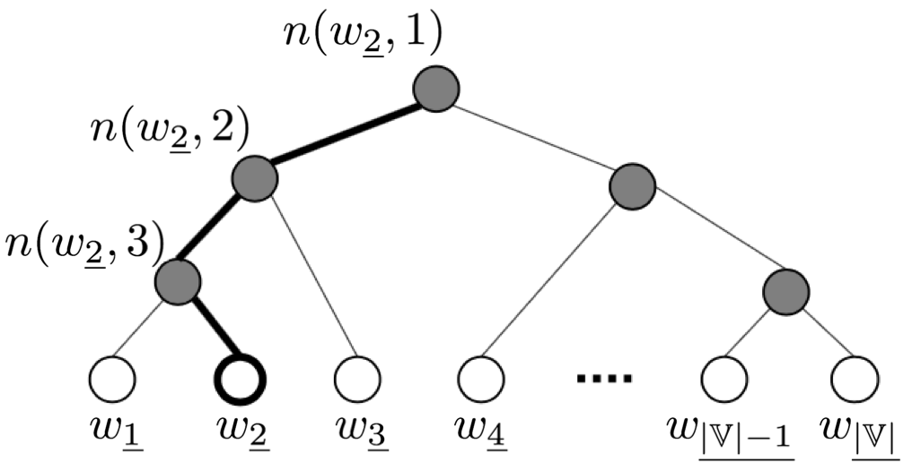

> Distributed Representations of Words and Phrases and their Compositionality
>
> Efficient Estimation of Word Representations in Vector Space

## CBOW(Continuous Bag-of-Words)

$$
\boldsymbol v_{t+j}=V\boldsymbol x_{t+j}  \\
\hat{\boldsymbol v}_t=\frac{1}{2m}\sum_j\boldsymbol v_{t+j} \\
\boldsymbol z=U\hat{\boldsymbol v}_t \\
\hat y_{i}=P(w_{ i}|w_{t-m},\cdots,w_{t-1},w_{t+1},\cdots,w_{t+m})=\text{softmax}(z_{ i})=\text{softmax}(\boldsymbol u_{ i}^\top \hat{\boldsymbol v}_t)
$$

损失函数的推导：
$$
\begin{align*}
\mathcal L &=-\log \hat y_t\\
&=-\log P(w_t|w_{t-m},...,w_{t-1},w_{t+1},...,w_{t+m})\\
&=-\log \text{softmax}(z_t)\\
&=-\log \frac{\exp (\boldsymbol u_t^\top \hat{\boldsymbol v}_t)}{\sum_{k=1}^{|\mathbb V|}\exp (\boldsymbol u_{\underline k}^\top \hat{\boldsymbol v}_t)}\\
&=-\boldsymbol u_t^\top \hat{\boldsymbol v}_t+\log \sum_{k=1}^{|\mathbb V|}\exp (\boldsymbol u_{\underline k}^\top \hat{\boldsymbol v}_t)\\
&=-z_t+\log \sum_{k=1}^{|\mathbb V|}\exp z_{\underline k}
\end{align*}
$$

## Hierarchical Softmax

$$
\begin{eqnarray}

&\sigma(\boldsymbol u_{n(w,j)}^\top \hat{\boldsymbol v}_t)\\

&1-\sigma(\boldsymbol u_{n(w,j)}^\top \hat{\boldsymbol v}_t)=\sigma(-\boldsymbol u_{n(w,j)}^\top \hat{\boldsymbol v}_t)

\end{eqnarray}
$$

##  Negative Sampling

==构造语料中不存在的上下文词对作为负样本，最大化正样本的同时最小化负样本的概率==

正样本的概率：
$$
P(\mathbb D=1|w,c)=\sigma(\boldsymbol u_{w}^\top \boldsymbol v_{c})
$$
全部正样本的似然：
$$
\prod_{(w,c)\in\mathbb D}P(\mathbb D=1|w,c)
$$
全部负样本的似然：
$$
\prod_{(w,c)\notin\mathbb D}P(\mathbb D=1|w,c)
$$
最大化下式：
$$
\begin{align*}
&\arg\max_{\theta}\prod_{(w,c)\in\mathbb D}P(\mathbb D=1|w,c)\prod_{(w,c)\notin\mathbb D}(1-P(\mathbb D=1|w,c)) \\
=&\arg\max_{\theta}\sum_{(w,c)\in\mathbb D}\log\sigma(\boldsymbol u_{w}^\top \boldsymbol v_{c}) + \sum_{(w,c)\notin\mathbb D}\log\sigma(-\boldsymbol u_{w}^\top \boldsymbol v_{c}) 
\end{align*}\\

\log\sigma(\boldsymbol u_{w}^\top \boldsymbol v_{c}) + \sum_{w_j\in W_{negative}}\log\sigma(-\boldsymbol u_{w_j}^\top \boldsymbol v_{c})
$$

## Sub-Sampling

$$
p(w_i)=1-\sqrt{\frac{sample}{freq(w_i)}}
$$

$$
p(w_i)=1-\Bigg(\sqrt{\frac{sample}{freq(w_i)}} + \frac{sample}{freq(w_i)}\Bigg)
$$

$sample$为超参数，建议设置为$1e^{-3}$到$1e^{-5}$。$freq(w_i)$ 表示词频。

​	
​	

​			
​				
​					

​			
​		
​	

